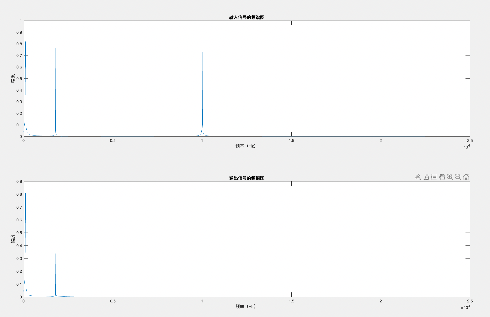

# FIR滤波器设计
## 需求分析
* 老师的要求
   在20～20kHz的音频范围内，按照人耳的音觉特征划分成三个频段（低音、中音、高音）设计三个带通滤波器。通过调节每个滤波器的增益，实现每个频段的增强和衰减，滤波器采用FIR结构，31阶。
   
* 需求解析：
	首先，根据百度分别将低音、中音、高音的频率设置为：20～200Hz、200～2kHz、2k～20KHz。因此，该毕业设计的目的在于设计一个20～200Hz的带通滤波器、一个200～2kHz的带通滤波器和一个2k～20kHz的带通滤波器。老师没有给定通过什么窗函数去设计该滤波器，所以默认使用布莱克曼窗函数对滤波器进行设计。
	

## matlab对滤波器进行设计。
1. 先将滤波器的频率f换算成𝛚，并进行归一化处理。使用的公式为：𝛚 = 𝛺 * T = 2*𝜋*f/fc
	𝛚1_L - 低音滤波器的下限频率；𝛚1_H - 低音滤波器的上限频率，以此类推。
	可能会奇怪为什么𝛚2_L是1000*。。。而不是200*。。。，是因为这里故意将频率往上调整一些，让波形效果更好看一点。45000为系统的采样频率fc。
```matlab
    %设计三个滤波器，分别是20～200Hz、200～2kHz、2k～20KHz的带通滤波器
w1_L = 20*2*pi/45000;      %对带通滤波器的上下限频率进行归一化处理。
w1_H = 200*2*pi/45000;
w2_L = 1000*2*pi/45000;     
w2_H = 2000*2*pi/45000;
w3_L = 3000*2*pi/45000;
w3_H = 20000*2*pi/45000;   
```
2. 定义窗函数的阶数为N，也就是滤波器的阶数，这里定义的是50阶滤波器。<span id="jump1"></span>
	wf1就是将上面的上下限滤波器组合成了一个数组，用于带入下面的函数，没什么具体含义。
```matlab
N = 50;                     % 布莱克曼窗函数长度 滤波器阶数
wf1 = [w1_L/pi w1_H/pi];
wf2 = [w2_L/pi,w2_H/pi];
wf3 = [w3_L/pi,w3_H/pi];
```
3. 生成滤波器。b1,b2,b3对应着低音、中音、高音三个带通滤波器，可以看到下面使用的是布莱克曼窗函数进行滤波器生成。
```matlab
window = blackman(N + 1);   %布莱克曼窗
b1 = fir1(N,wf1,window);
b2 = fir1(N,wf2,window);
b3 = fir1(N,wf3,window);
```
4. 生成数字滤波器的幅度特性图，该图展现了滤波器的滤波效果。
	横坐标为频率Hz，可以自己对应一下刚刚我们设计三个带通滤波器的需求。
	纵坐标为滤波器的增益（单位为db）0db代表增益等于1，也就是输入信号是什么输出信号就是什么，相应的，比0小的数值则表示该频率的信号经过滤波器后会被衰减。
```matlab
[H1,W1] = freqz(b1);        %计算数字滤波器的频率特性
[H2,W2] = freqz(b2);
[H3,W3] = freqz(b3);
figure(1);
subplot(3,1,1);plot(W1*45000/2/pi,20*log10(abs(H1)));grid on;   %画出频率特性图
xlabel('Hz');ylabel('幅度(dB)');title('低音滤波器的幅度特性')
subplot(3,1,2);plot(W2*45000/2/pi,20*log10(abs(H2)));grid on;
xlabel('Hz');ylabel('幅度(dB)');title('中音滤波器的幅度特性')
subplot(3,1,3);plot(W3*45000/2/pi,20*log10(abs(H3)));grid on;
xlabel('Hz');ylabel('幅度(dB)');title('高音滤波器的幅度特性')
```


* **为什么31阶的滤波器性能不够??**
	我们将上面[第二步](#jump1)的滤波器阶数改为31，同样得到滤波器幅度特性图如下。可以看到这张图里面的中音滤波器在频率小的时候不像上一张50阶滤波器有衰减作用，也就是说31阶的中音滤波器无法对低音起到衰减作用。故该滤波器31阶是不满足设计要求的。你也可以试试将滤波器的阶数进一步提升，加到1000阶的话，会得到完美的理想滤波器（波形近似于方形）。
	
	
5. 对输入波形和输出波形进行查看。<span id="jump2"></span>
	fIN代表输入波形，由三个频率分别为100，1800，10000Hz的正弦波叠加组成。
	amp代表三个滤波器的增益，通过调节amp1、2、3可以分别对低音、中音、高音滤波器的输出幅值进行调节。下面的代码中，除amp1等于1以外，别的都是零，代表当前输入波形仅通过了低音的带通滤波器，而别的滤波器输出来的信号由于增益等于零，都没有了。
	下图是输入信号和输出信号的对比，上面已经提到，该滤波器仅打开了低音带通滤波器，可以看到确实是将输入信号的高频信号滤除了一些，但是还是有一些中频的信号存在，但是中频信号的幅值已经被衰减了。
	你可以自己调整一下amp1、2、3的大小，看看这幅图会怎么变化。
```matlab
amp1 = 1;   %低音增益
amp2 = 0;   %中音增益
amp3 = 0;   %高音增益
f1 = 100;f2 = 1800; f3 = 10000; %输入波形由三个频率分别为100，1800，10000Hz的正弦波组成
Fs = 45000;     %采样频率45000Hz    
dt = 1/Fs; n = 0:3000;   t = n*dt;
fIN = sin(2*pi*f1*t) + sin(2*pi*f2*t) + sin(2*pi*f3*t);
fOUT = amp1 * filter(b1,1,fIN) + amp2 * filter(b2,1,fIN) + amp3 * filter(b3,1,fIN); %%输入波形
figure(2);
subplot(2,1,1);plot(t,fIN);
subplot(2,1,2);plot(t,fOUT);
```


6. 画出输入输出信号的频谱图
	一般的图的横坐标都是时间轴，而频谱图的横坐标是频率，是对[第五步](#jump2)的信号图进行FFT变换之后得到的。频谱图可以看出信号中的频率成分，观察信号中存在什么频率的波形。
	下图可以看到输入信号存在100，1800，10000Hz的三种频率成分，与[第五步](#jump2)中设计的输入信号对应。经过滤波器（只打开了低音滤波器）之后，输出信号的频谱图可以明显看到10000Hz高音频率的波形被完全滤除了，而1800Hz中音频率被衰减了一半。与输入输出信号的波形对比图结果相对应。
	至此，matlab的功能完成。首先是设计出了符合要求的数字滤波器b1,b2,b3，在通过自己设计的输入信号进行验证该滤波器是否满足设计需求。根据输入输出信号波形图和频谱图，可以证明，该滤波器的设计是满足要求的，如果性能想要更进一步的提升，可以通过增加滤波器阶数实现。
```matlab
    %对滤波后的波形进行fft
L = 3000;
fOUT_fft = fft(fOUT);
P2_OUt = abs(fOUT_fft/L);
P1_OUT = P2_OUt(1:L/2+1);
P1_OUT(2:end-1) = 2*P1_OUT(2:end-1);
f = Fs*(0:(L/2))/L;
fIN_fft = fft(fIN);
P2_IN = abs(fIN_fft/L);
P1_IN = P2_IN(1:L/2+1);
P1_IN(2:end-1) = 2*P1_IN(2:end-1);
figure(3);
subplot(2,1,1);plot(f,P1_IN);
xlabel('频率（Hz）');ylabel('幅度');title('输入信号的频谱图')
subplot(2,1,2);plot(f,P1_OUT);
xlabel('频率（Hz）');ylabel('幅度');title('输出信号的频谱图')
```


## dsp实验
```c
/* autor:Johnny
 * Create Date:2021/4/7
 * Project:FIR_filter_3
 * description:
 *      *设计三个滤波器，分别是20~500Hz（低音），500~2kHz（中音），2k~20kHz（高通）的带通滤波器
 *      *低、中、高音的采样频率分别是5000Hz,20kHz,200kHz
 *      *使用的滤波器窗函数为布莱克曼窗
 */
#include "DSP28x_Project.h"
#include "math.h"

#define FIRNUMBER 51               //滤波器阶数
#define SIGNAL_LOW_FREQ 100.0         //低音频率
#define SIGNAL_MIDDLE_FREQ 1800.0     //中音频率
#define SIGNAL_HIGH_FREQ 10000.0      //高音频率
#define SIGNAL_SAMPLE_FREQ 45000.0    //信号采样频率
#define PI 3.1415926

float InputWave();
float FIR();
float fXn[FIRNUMBER] = {0.0};   //输入数据
float amp_low = 1;      //低音滤波器增益
float amp_middle = 0;   //中音滤波器增益
float amp_high = 0;     //高音滤波器增益
int nIn = 0,nOut = 0;   //对输入输出数据进行计数
float dt = 1.0/SIGNAL_SAMPLE_FREQ;   //采样周期
float t = 0;    //当前时间
float fIn[3000];  //输入信号
float fOut[3000]; //输出信号
int i = 0;

//低音滤波器 布莱克曼窗
float fHn_low[FIRNUMBER] ={0,6.35753836614680e-05,0.000260387449245185,
                           0.000605610599773531,0.00112161581237028,0.00183624371284657,
                           0.00278040059538717,0.00398513789066797,0.00547841737507434,
                           0.00728179274828003,0.00940725093084357,0.0118544524471621,
                           0.0146085896026421,0.0176390450266035,0.0208989838003997,
                           0.0243259530195587,0.0278434971629851,0.0313637304290979,
                           0.0347907427735765,0.0380246591201596,0.0409661250369475,
                           0.0435209602756258,0.0456047062148008,0.0471467955827736,
                           0.0480940928247141,0.0484135899009650,0.0480940928247141,
                           0.0471467955827736,0.0456047062148008,0.0435209602756258,
                           0.0409661250369475,0.0380246591201596,0.0347907427735765,
                           0.0313637304290979,0.0278434971629851,0.0243259530195587,
                           0.0208989838003997,0.0176390450266035,0.0146085896026421,
                           0.0118544524471621,0.00940725093084357,0.00728179274828003,
                           0.00547841737507434,0.00398513789066797,0.00278040059538717,
                           0.00183624371284657,0.00112161581237028,0.000605610599773531,
                           0.000260387449245185,6.35753836614680e-05,0};

//中音滤波器
float fHn_middle[FIRNUMBER] ={0,2.62507673718510e-05,3.78679175244498e-05,
                              -9.14600371280999e-05,-0.000518718688872788,-0.00142000186521711,
                              -0.00296707550238403,-0.00529080967688430,-0.00843433496063362,
                              -0.0123034152935242,-0.0166253562937008,-0.0209294652656129,
                              -0.0245607061431745,-0.0267334929672684,-0.0266251208291305,
                              -0.0234995115077018,-0.0168436484111054,-0.00649330158623013,
                              0.00727695593083420,0.0237210093024314,0.0416590535379205,
                              0.0595875625720808,0.0758497566608739,0.0888430530340351,
                              0.0972318342855958,0.100131291720504,0.0972318342855958,
                              0.0888430530340351,0.0758497566608739,0.0595875625720808,
                              0.0416590535379205,0.0237210093024314,0.00727695593083420,
                              -0.00649330158623013,-0.0168436484111054,-0.0234995115077018,
                              -0.0266251208291305,-0.0267334929672684,-0.0245607061431745,
                              -0.0209294652656129,-0.0166253562937008,-0.0123034152935242,
                              -0.00843433496063362,-0.00529080967688430,-0.00296707550238403,
                              -0.00142000186521711,-0.000518718688872788,-9.14600371280999e-05,
                              3.78679175244498e-05,2.62507673718510e-05,0};
//高音滤波器
float fHn_high[FIRNUMBER]  = {0,-5.27456865575372e-06,9.59536844320978e-05,
                              -0.000231750994362748,0.000104226185037776,-0.000965661086629212,
                              -0.000661785312803055,-0.00145139744031683,-0.00239812847151537,
                              0.000733143087277754,-0.00368971498084646,0.00797073645695238,
                              -0.00182982869079129,0.0179316795660689,0.00447142531117082,
                              0.0196031787730264,0.0120969437620868,-0.00348898667208083,
                              0.0143117620138948,-0.0608929768600093,0.00642186953686290,
                              -0.141920992264735,-0.00850976087252026,-0.214932418120473,
                              -0.0204671062730046,0.755562846288573,-0.0204671062730046,
                              -0.214932418120473,-0.00850976087252026,-0.141920992264735,
                              0.00642186953686290,-0.0608929768600093,0.0143117620138948,
                              -0.00348898667208083,0.0120969437620868,0.0196031787730264,
                              0.00447142531117082,0.0179316795660689,-0.00182982869079129,
                              0.00797073645695238,-0.00368971498084646,0.000733143087277754,
                              -0.00239812847151537,-0.00145139744031683,-0.000661785312803055,
                              -0.000965661086629212,0.000104226185037776,-0.000231750994362748,
                              9.59536844320978e-05,-5.27456865575372e-06,0};


void main(void){
    nIn = 0; nOut = 0;
    while(1){
        fIn[nIn] = InputWave();
        nIn++;
        fOut[nOut] = FIR();
        nOut++;
        if(nOut == 3000){
            nOut = 0; //在这里设立断点
            nIn = 0;
        }
    }
}

float InputWave(){
    for (i = FIRNUMBER - 1;i > 0; i--){
        fXn[i] = fXn[i - 1];
    }
    t = nOut * dt;
    fXn[0] = sin(2.0*PI*SIGNAL_LOW_FREQ*t)
                + sin(2.0*PI*SIGNAL_MIDDLE_FREQ*t) + sin(2.0*PI*SIGNAL_HIGH_FREQ*t);
    return (fXn[0]);
}

float FIR(){
    float fSum;
    fSum = 0;
    for(i = 0;i<FIRNUMBER;i++){
        fSum+=amp_low*fXn[i]*fHn_low[i] + amp_middle*fXn[i]*fHn_middle[i] + amp_high*fXn[i]*fHn_high[i];
    }
    return (fSum);
}
```
1. 首先给出dsp的代码，如上所示。
	```float InputWave()```为自己模拟的输入波形，该波形与Matlab里面的波形是一样的。
	```float FIR()```为对该波形进行FIR滤波器计算函数。
	同样可以通过对以下的amp进行更改，来调整滤波器的增益。
```
	float amp_low = 1;      //低音滤波器增益
	float amp_middle = 0;   //中音滤波器增益
	float amp_high = 0;     //高音滤波器增益
```
2. 实验结果
	* 输入信号
	* 输出信号（仅使用低音滤波器）
	* 输出信号（仅使用中音滤波器）
	* 输出信号（仅使用高音滤波器）
	* 输入信号频谱图
	* 输出信号频谱图（仅使用低音滤波器）
	* 输出信号频谱图（仅使用中音滤波器）
	* 输出信号频谱图（仅使用高音滤波器）

	可以看出，与Matlab的仿真结果是完全对应的。


